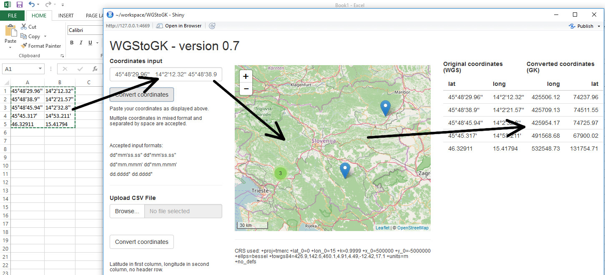

Tired of converting WGS coordinates to local CRS one at a time?

This application will convert WGS84 coordinates (what you would encounter on Google Maps or GPS devices) to a CRS selected by user.

It enables you to batch convert coordinates with ease. You can copy data from your spreadsheet editor into the application. It will convert coordinates to preffered CRS upon click. You can also upload a batch file (CSV or GPX). 
With the latest version, user is able to choose the CRS to convert coordinates to.

Future improvements:

 * pick coordinates from map
 * interactive display of coordinates and markers

Bug reports and improvements (pull requests) welcome in the Issue section.

Authors can be contacted through this portal or on Twitter [@zkuralt](https://twitter.com/zkuralt) and [@romunov](https://twitter.com/romunov).